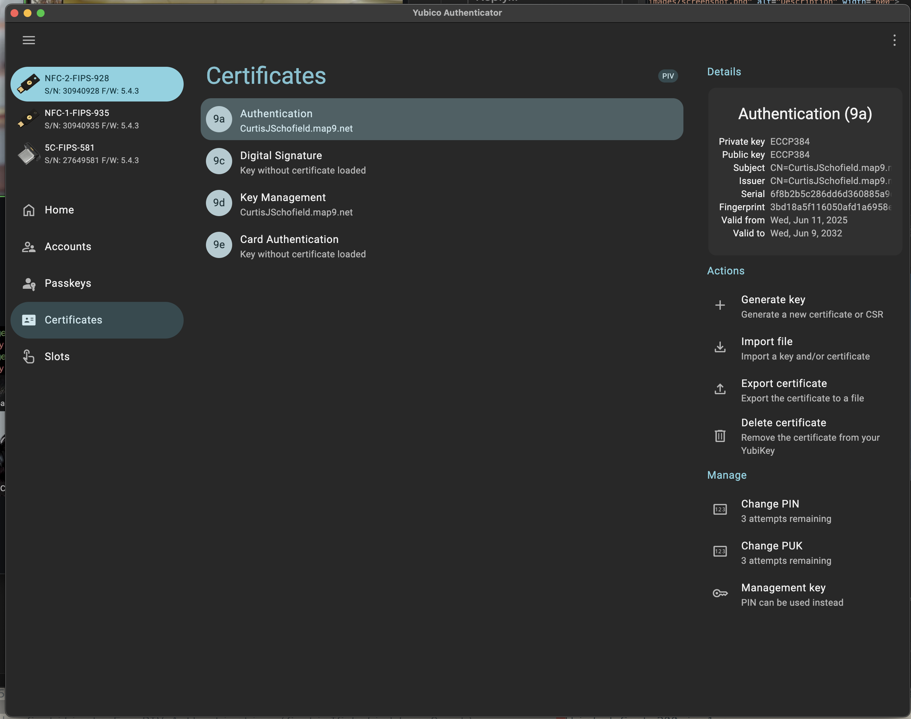
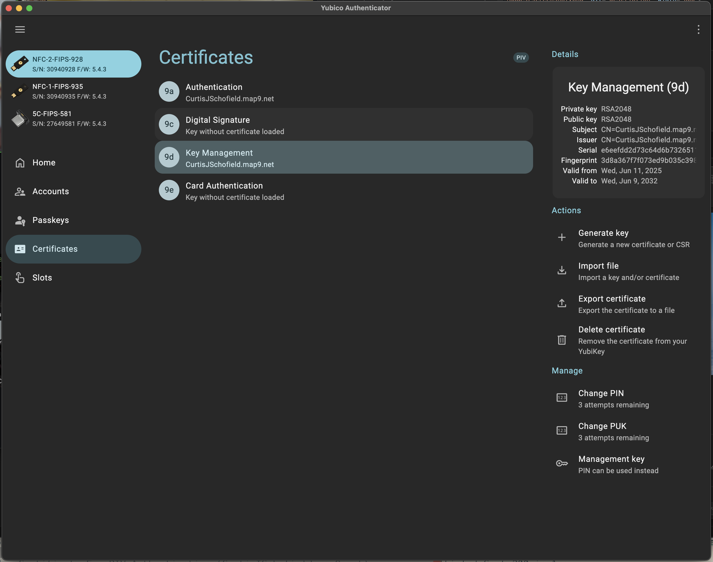

# Introduction to PKCS#12 Generation Helpers

These helper scripts streamline the process of creating **PKCS#12 (PFX) files**, complete with their associated **RSA or ECC key pairs** and **certificates**. They're specifically designed to help you generate cryptographic assets for use with smart cards, such as **YubiKeys for macOS authentication**.

**The end result:** Insert your YubiKey, enter your PIN once, and gain full access to both your macOS system and all your saved passwords without typing any additional passwords.

## What You'll Accomplish

By following this guide, you will:

1. **Generate two cryptographic certificates** (one RSA2048, one ECCP384) using the provided scripts
2. **Load these certificates onto your YubiKey** into specific PIV slots (9a and 9d)
3. **Pair your YubiKey with your macOS user account** using the `sc_auth` command
4. **Enable passwordless authentication** - login to macOS and unlock your keychain using only your YubiKey PIN

**What this means for you:** No more typing passwords! Simply insert your YubiKey, enter your PIN once, and you'll have complete access to your Mac and all your stored passwords, credit cards, and other sensitive information.

---

## Loading Certificates onto YubiKey

After generating your PKCS#12 files, you'll need to load them onto your YubiKey using YubiKey Authenticator or command-line tools:

1. **Install YubiKey Authenticator**: Download from [Yubico's website](https://www.yubico.com/products/yubico-authenticator/)
2. **Load the certificates**:
   - Load the ECC P384 certificate (from `secp.gen.zsh`) into slot 9a
   - Load the RSA2048 certificate (from `rsa.gen.zsh`) into slot 9d
3. **Set a PIN** if you haven't already

Alternatively, you can use the command-line tool `ykman` to load certificates programmatically.


>**Tip:** Typically, there are 4 distinct slots on a YubiKey used for different  purposes. We will use 2 of them 9a and 9d.

## YubiKey Slot Configurations

There are 4 slots in a PIV configuration. 9A and 9D slots must be configured in order to pair a PIV "SmartCard" to the macOS operating system.


There are some important constraints that must be observed for compatibility.

### 9a (PIV Authentication) - Key Pair Algorithm: ECC P384

**Purpose: Login to macOS**

This slot handles your initial login authentication to macOS. When you insert your YubiKey and enter your PIN at the login screen, macOS uses the certificate in slot 9a to verify your identity and grant you access to your user account.

This slot is configured with an **Elliptic Curve Cryptography (ECC) P384** key pair. We chose this algorithm for its strong compatibility with **FIPS 140** standards and its inherent cryptographic strength, making it ideal for authorization purposes.


### 9d (Key Management) - Key Pair Algorithm: RSA2048

**Purpose: Unlock Login Keychain**

This slot is specifically designed to unlock your macOS Login Keychain after you've logged in. The Login Keychain stores your saved passwords, certificates, and other sensitive data. Without the 9d certificate, you'd need to manually enter your keychain password every time you want to access stored credentials.

This slot uses an **RSA2048** key pair. This specific choice ensures **compatibility with the macOS operating system's Login Keychain**. Using a different cryptographic algorithm here could prevent the Login Keychain password from being signed correctly, leading to authentication issues.

### Why Both Are Required

macOS treats these as separate security layers - one for system access (9a) and one for credential access (9d). Both must be properly configured for seamless YubiKey authentication that eliminates the need for typing passwords.

---

## Script Overview

These scripts (e.g., `rsa.gen.zsh` and `secp.gen.zsh`) streamline the generation process. Each script expects **exactly two arguments**: a **prefix** and a **Common Name (CN)**.

The **Common Name (CN)** should be a unique identifier for your certificate. Recommended options:
- A domain name: john.doe.com
- An email: john.doe@doe.com

When you provide these arguments:
* The script creates a dedicated directory structure for your cryptographic files.
* It then uses `openssl` commands to generate the necessary key pairs and certificates.

To prevent accidental data loss, the script checks if the target directory already exists. If it does, the script will **not overwrite** existing files and will exit gracefully. If arguments are not provided, the script displays helpful usage instructions and examples.

---

## How to Use

Follow these simple steps to generate your PKCS#12 files:

> **Tip:** The `prefix` argument is intended to help you identify the purpose of your keys. While you can use any prefix, it is recommended to use `9d` for RSA2048 encrypted certificates and `9a` for SECP (ECCP384)encrypted certificates. This naming convention makes it clear which certificate is intended for which YubiKey slot and helps avoid confusion later.


### Make the Scripts Executable:

After checking out this git repository, first ensure both scripts have execute permissions:

```bash
chmod +x ./rsa.gen.zsh
chmod +x ./secp.gen.zsh
```

### Run it from your terminal:

```bash
./rsa.gen.zsh <your_prefix> <your_common_name>
./secp.gen.zsh <your_prefix> <your_common_name>
```
### Example with Explanation:

For a user who has owns the domain CNAME "john.doe.net" and wants to associate themselves with this common name:

```bash
./rsa.gen.zsh 9d john@doe.net    # Creates RSA2048 certificate for keychain access
./secp.gen.zsh 9a john@doe.net   # Creates ECC P384 certificate for login
```

You will be also prompted for a password for encryption of the PFX certificate. If you enter a password, YubiKey Authenticator will also request that you repeat the same password. It is recommended that you store this password in a Password Manager.

**Generated files and their purpose:**
```
./john@doe.net/9a/9a.secp384r.pfx  # Import into Authentication slot (9a)
./john@doe.net/9d/9d.rsa.pfx       # Import into Key Management slot (9d)
```

These PFX certificates can be loaded into your YubiKey via YubiKey Authenticator.

---
## Loading the Certificates with YubiKey Authenticator.

1. You must establish a PIN as previously mention.

2. it is recommended that you set a management key and store it in your password manager.

At this point you can import certificates.



Using this screenshot as a reference, you can see that YubiKey Authenticator has a section named "Certificates". Certificates is used for PIV SmartCards. 

After selecting the "Authentication" Certificate you can use the "import file" button on the right side to import the `9a.secp384r.pfx` file (the ECC P384 certificate generated by the `secp.gen.zsh` script).




Using this screenshot as a reference, you can see that in addition there is a "Key Management" certificate that can be used with PIV SmartCards. 

After selecting the "Key Management" Certificate you can use the "import file" button on the right side to import the `9d.rsa.pfx` file (the RSA2048 certificate generated by the `rsa.gen.zsh` script).

---
## Integration with macOS

Prerequisites:

You *must* have attach a PIN to your PIV identity using YubiKey Authenticator.


---

The utility `sc_auth` can be used to pair the PIV YubiKey with a specific user account on macOS.

In order to understand which identity hash can be used you can run the following command.

List Identities
```bash
sc_auth identities
```
The `sc_auth identities` command will generally list a single SmartCard. I have noticed that it lists the last SmartCard inserted in the event that multiple smartcards are plugged into the device.

With a specific hash - you can bind the hash to your user using the `sc_auth pair` command. The input `identity-hash` should be an unpaired identity that can be used for authentication. $USER is your current user on the system.

```bash
sc_auth pair -u $USER -h identity-hash
```

When you have successfully paired a hash with a user you can verify this by using an additional `sc_auth` command.

```bash
sc_auth list -u $USER
```

Additionally `sc_auth identities` will now list your hash as a "Paired identities which are used for authentication" along with the user you have paired to your PIV Authentication Certificate.

At this point if you have used the correct 9a and 9d style certificates you will be able to log in with your PIN.

**Testing your setup:** To verify everything is working correctly, log out of your Mac and log back in. You should be able to authenticate using only your YubiKey PIN, without needing to type your user password or keychain password.

---

## Troubleshooting

### Common Issues and Solutions

**Problem: YubiKey not recognized**
- Ensure your YubiKey is properly inserted
- Try reinserting the YubiKey  
- Check that YubiKey Authenticator can detect the device
- Verify detection with: `ykman piv info`

**Problem: Certificate loading fails**
- Verify the PKCS#12 files were generated correctly
- Check that you're loading the correct certificate to the correct slot:
  - ECC P384 (`9a.secp384r.pfx`) goes to slot 9a (Authentication)
  - RSA2048 (`9d.rsa.pfx`) goes to slot 9d (Key Management)
- Ensure your YubiKey PIV application has been initialized with a PIN

**Problem: `sc_auth identities` shows no devices**
- Make sure your YubiKey is inserted and detected by the system
- Verify certificates are properly loaded into slots 9a and 9d
- Try running `ykman piv info` to verify PIV configuration

**Problem: Authentication fails after pairing**
- Confirm both 9a and 9d slots have certificates loaded
- Verify the PIN is set correctly on your YubiKey
- Check that the correct identity hash was used in the pairing command

**Problem: Login works but keychain still requires password**
- Ensure the RSA2048 certificate is in slot 9d (not 9a)
- Verify the 9d certificate was generated and loaded correctly
- Try unpairing and re-pairing the identity

**Problem: Multiple YubiKeys causing conflicts**
- Remove other YubiKeys when setting up authentication
- Use `sc_auth identities` to verify which device is being detected
