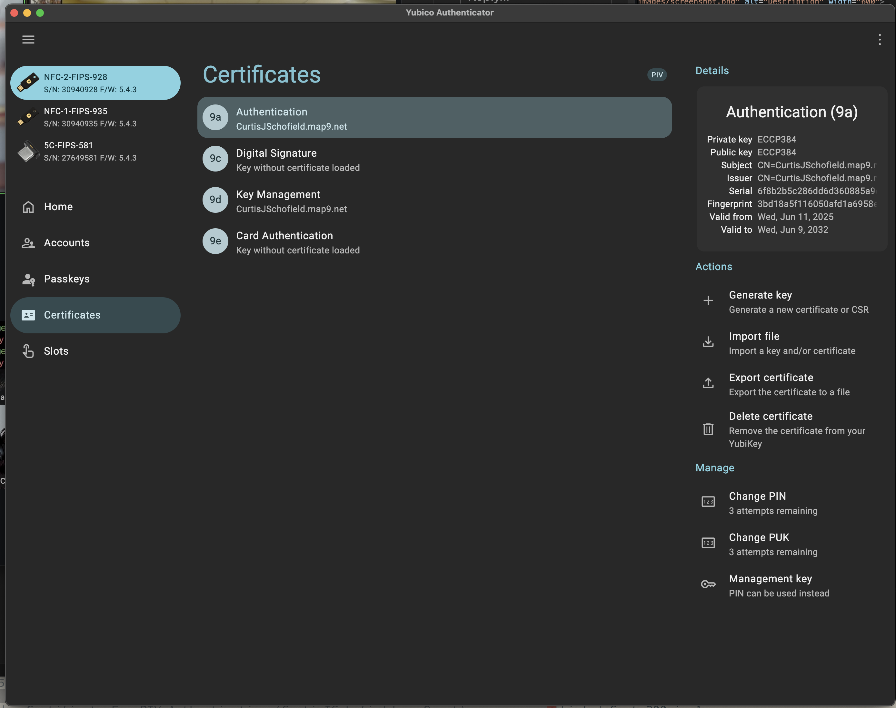
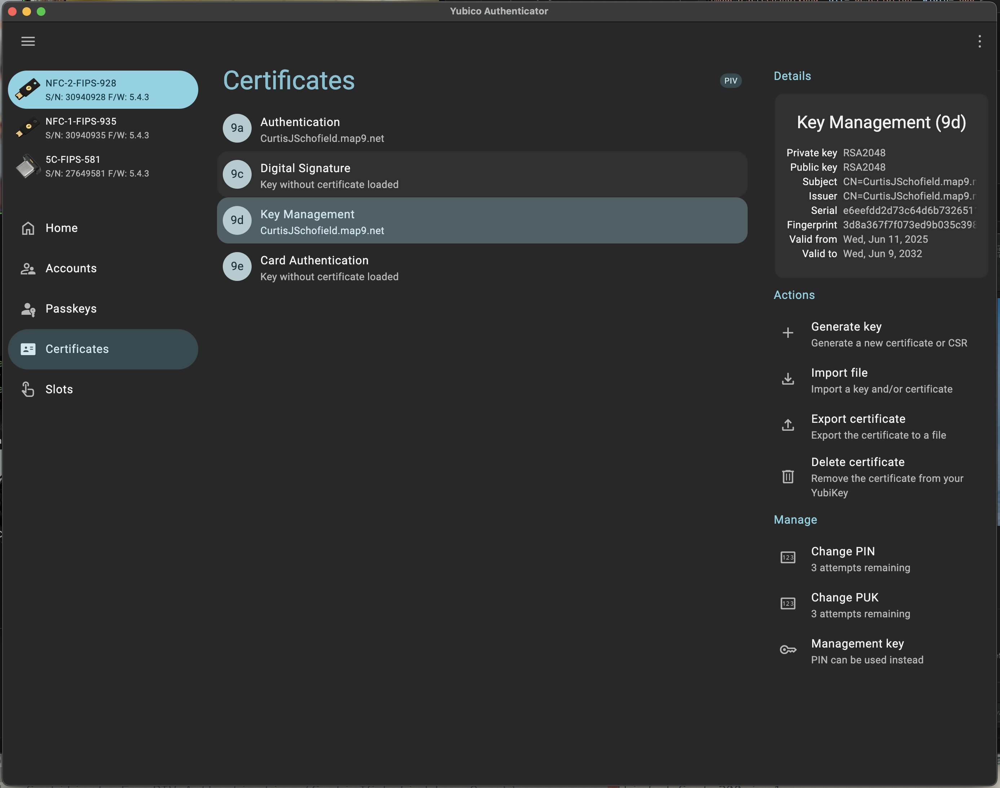

# PIV Certificate Helpers

Generate PKCS#12 certificates for YubiKey authentication on macOS. These scripts create the required certificates for passwordless login and keychain access.

**Result:** Insert your YubiKey, enter your PIN once, and access both macOS and your keychain without typing passwords.

## Quick Start

1. **Generate certificates:**
   ```bash
   chmod +x *.zsh
   ./secp.gen.zsh 9a your@email.com  # For login (slot 9a)
   ./rsa.gen.zsh 9d your@email.com   # For keychain (slot 9d)
   ```

2. **Load onto YubiKey:** Import the generated `.pfx` files using YubiKey Authenticator
3. **Pair with macOS:** Use `sc_auth pair` to enable authentication


## Certificate Requirements

### Slot 9a (Authentication) - ECC P384
- **Purpose:** macOS login authentication
- **Algorithm:** ECC P384 (FIPS 140 compatible)

### Slot 9d (Key Management) - RSA2048  
- **Purpose:** Unlock macOS keychain
- **Algorithm:** RSA2048 (required for keychain compatibility)

Both certificates are required for complete passwordless authentication.

## Usage

### Generate Certificates

Each script requires a prefix (slot number) and Common Name. Use an email or domain for the Common Name:

```bash
./secp.gen.zsh 9a john@doe.net    # Creates ECC P384 for authentication
./rsa.gen.zsh 9d john@doe.net     # Creates RSA2048 for keychain
```

**Output files:**
```
./john@doe.net/9a/9a.secp384r.pfx  # Load into slot 9a (Authentication)
./john@doe.net/9d/9d.rsa.pfx       # Load into slot 9d (Key Management)
```

**Note:** The scripts will prompt for a PFX password - store this in your password manager.

### Load into YubiKey

1. Install [YubiKey Authenticator](https://www.yubico.com/products/yubico-authenticator/)
2. Set a PIN if not already configured
3. Import certificates using the "Import" button:
   - **Authentication (9a):** Import the `9a.secp384r.pfx` file  
   - **Key Management (9d):** Import the `9d.rsa.pfx` file




### Pair with macOS

**Prerequisites:** YubiKey must have a PIN set and both certificates loaded.

1. **Find your identity:**
   ```bash
   sc_auth identities
   ```

2. **Pair with your user:**
   ```bash
   sc_auth pair -u $USER -h <identity-hash>
   ```

3. **Verify pairing:**
   ```bash
   sc_auth list -u $USER
   ```

Your YubiKey is now ready for passwordless authentication. You can test by logging out and back in using only your YubiKey PIN.

## Troubleshooting

See ./LONGFORM.md
